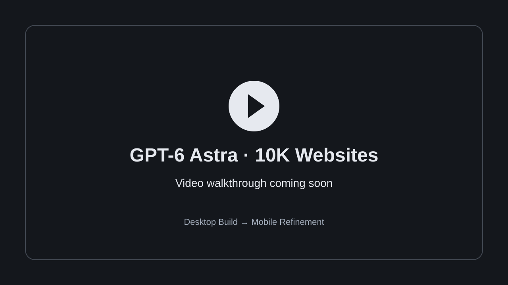

<!-- When the tutorial is ready, replace the preview below with:

Then remove the coming-soon line and the placeholder SVG if no longer needed.
-->

**Video walkthrough: coming soon.** The thumbnail above will link to the full tutorial when it is available.

# GPT-6 Astra · 10K Websites

Two reusable prompts for building a distinctive brand website with GPT-6 Astra: start with **Desktop Build**, then use **Mobile Refinement** to create a tailored phone experience within the same website and codebase.

The workflow starts with your business and brand, establishes a visual direction, and brings together custom imagery, a cinematic scroll story, and editable website content.

## Start here

| Order | Prompt | What it does |
| --- | --- | --- |
| 1 | [Desktop Build](prompts/01-desktop-build.md) | Builds the complete website, from the business brief and brand direction to visual assets, scroll animation and site content. |
| 2 | [Mobile Refinement](prompts/02-mobile-refinement.md) | Refines the existing website for phones with portrait assets, mobile navigation, composition and scroll timing. |

## What you need

- GPT-6 Astra in a coding environment that can create and run a website.
- **Higgsfield MCP connected, with image and video generation tools available.** These prompts use Higgsfield MCP to generate brand assets, images and videos, including the media used in the scroll-scrubbing animation.
- Access to the generation models required by your chosen workflow. Asset generation may use paid credits in your Higgsfield account.
- A hosting option when you are ready to publish. The prompt follows the workflow available in your environment.

**Higgsfield referral link: coming soon.**
<!-- Replace the line above with your referral link and an appropriate referral disclosure before public release. -->

The prompts provide instructions; they do not install or connect Higgsfield MCP for you.

## 1. Build your website

Open [Desktop Build](prompts/01-desktop-build.md), copy the entire prompt, and paste it into your website project conversation.

Share your business description and any existing company information, logo, colours, imagery or brand guidelines at the start. The prompt will ask for important missing information.

If you do not have an identity yet, describe your business and provide any reference websites, images or aesthetic direction you like. The workflow uses those references to propose a brand direction and generate assets where needed. You can choose the direction you like before the rest of the website is built.

You will also be asked about the visual story you want the website to tell. Describe the experience in your own words, or ask for suggestions. The prompt proposes a scene-by-scene story with website copy so you can review it before production.

For example:

> Build a website for my coffee shop. I want it to feel warm, welcoming and contemporary. I do not have a logo yet, but I have attached references I like. Guide me through the brand direction and visual story before building the site.

For a guided experience, say that you want to work step by step. If you prefer the model to choose, say “choose for me” or “build a template.” The prompt supports both approaches.

## 2. Refine the mobile experience

Once the first website is built, copy [Mobile Refinement](prompts/02-mobile-refinement.md) into **the same conversation and project**.

This follow-up adapts the existing design for phones. It requests dedicated portrait imagery and connected animation clips, preserves the selected brand identity, and adjusts navigation, typography, spacing, framing and scroll timing for smaller screens.

**Desktop and mobile remain one responsive website in one codebase.** The appropriate layout and animation assets are selected automatically for the viewport. The mobile prompt also asks for desktop to be checked again after the changes.

The main prompt already includes responsive requirements. This second prompt adds a more deliberately composed mobile experience and may require additional image and video generation.

## Before you launch

Review the business information, copy, links and primary action. Check the actual desktop and phone experiences, and confirm that any forms have a working destination. Publish when you are happy with the result.

“10K” describes the design ambition of the project; it is not a claim of a completed sale or a guaranteed website valuation.
